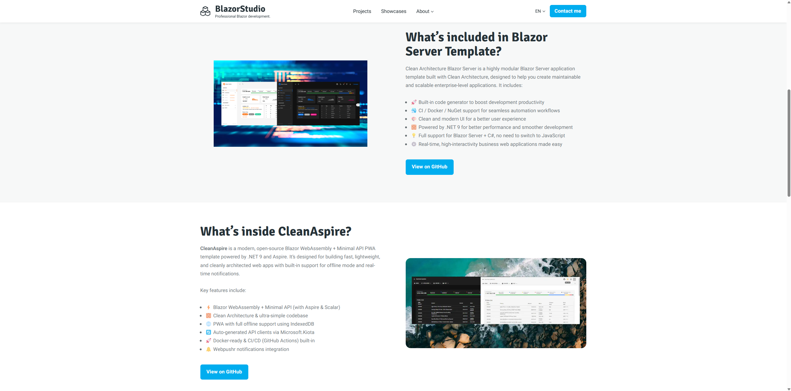

# My Personal Website

> 🌟 This website is based on the beautiful [Hugobricks](https://github.com/jhvanderschee/hugobricks) theme by [jhvanderschee](https://github.com/jhvanderschee). Many thanks for sharing such a great template under the MIT License!

Welcome to my personal website!  
This site serves as a hub to showcase my open-source projects, real-world enterprise business applications, and personal technical journey.

## 🌐 About the Website

This website is built using [Hugo](https://gohugo.io/), a fast and modern static site generator. It supports both English and Chinese content, making it easy for a global audience to explore my work.

## 📂 What You’ll Find Here

- **🚀 Open Source Projects**  
  Explore the source code and documentation for the tools, frameworks, and templates I’ve developed or contributed to.

- **🏢 Real-World Enterprise Applications**  
  Discover practical examples of enterprise systems I’ve built, including architecture design, implementation details, and solutions tailored for industries such as manufacturing, sales, and operations.

- **📝 Technical Articles**  
  Read posts about software engineering practices, architecture patterns, and hands-on development tips from my professional experience.

## 📎 Repository Contents

- `content/` – Website content including blog posts and project pages  
- `layouts/` – Custom layouts and theme adjustments  
- `static/` – Static assets like images and downloads  
- `config.toml` – Hugo site configuration  

## 📄 License

This project is licensed under the [MIT License](LICENSE).

